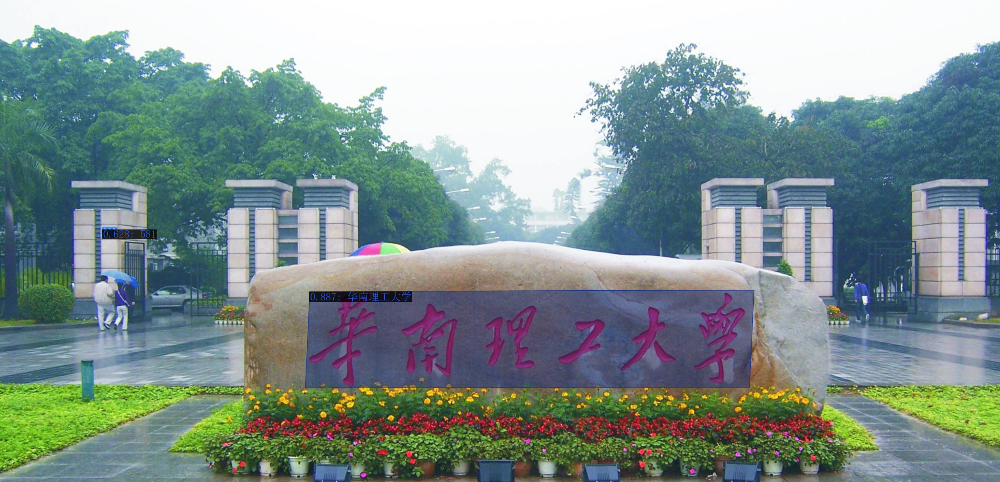
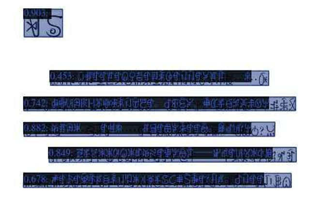

# ABCNet_Chinese
A demo for end-to-end English and Chinese text spotting using ABCNet. This is served as a base setting for others to train their own model on Chinese or other language. Official [ABCNet_v2](https://arxiv.org/abs/2105.03620) models has been released in [AdelaiDet](https://github.com/aim-uofa/AdelaiDet).

# Installation
Install detectron2 using the provided version (support visualizing Chinese text):
```
python -m pip install -e d2
```
Install this repo:
```
python setup.py build develop
```
If the above succeed, you can now run the demo using the provided model.


# Model
This is our model that can be used for evaluation or pretraining. 

```
wget https://drive.google.com/file/d/1iWX2n_BmyltVwQmfj8_oM9z7cJlq1P0m/view?usp=sharing -O model_chn.pth
```
Simply put the model in the root directory of the repo. 

# Demo

```
bash demo.sh
```

# Example results
If you successfully run the demo, you will get the output below:
<div align="center">
    
</div>

Other results (same project but not using the provide model):

Document-like Ancient words, e.g., “彝文”:
<div align="center">
    
</div>

# Cite
If you find this repo useful, please cite:
```
@article{liu2021abcnet,
  title={ABCNet v2: Adaptive Bezier-Curve Network for Real-time End-to-end Text Spotting},
  author={Liu, Yuliang and Shen, Chunhua and Jin, Lianwen and He, Tong and Chen, Peng and Liu, Chongyu and Chen, Hao},
  journal={arXiv preprint arXiv:2105.03620},
  year={2021}
}
```

# Data
We provide the converted json files of ArT, LSVT, and ReCTS that we have used for training ABCNet_Chinese.

- ReCTs [[images&label]](https://drive.google.com/file/d/1ygDN1OHUusqzqJL2011wc2T_LX0t6Th4/view?usp=sharing)(1.7G) [[Origin_of_dataset]](https://rrc.cvc.uab.es/?ch=12)

- LSVT [[images&label]](https://drive.google.com/file/d/1E9RMFiRaRW4WdzA9Py7OimfzA82-Bwik/view?usp=sharing)(8.2G) [[Origin_of_dataset]](https://rrc.cvc.uab.es/?ch=16)

- ArT [[images&label]](https://drive.google.com/file/d/1w5FPlgVJxUoUsLvFF_niy2s8lQPv7LYo/view?usp=sharing)(1.5G)  [[Origin_of_dataset]](https://rrc.cvc.uab.es/?ch=14)

- SynChinese130k [[images&label]](https://drive.google.com/file/d/1aH_i0eWW3ovudZbcQjngnVaVwH06p8Jc/view?usp=sharing)(25G) [[Origin_of_dataset]](https://arxiv.org/abs/2105.03620)


# License 
For academic use, this project is licensed under the 2-clause BSD License - see the LICENSE file for details. For commercial use, please contact [Chunhua Shen](mailto:chhshen@gmail.com).
